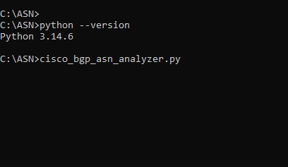
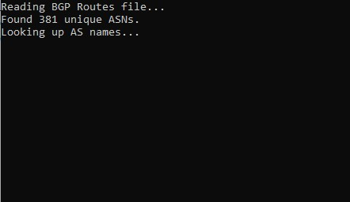
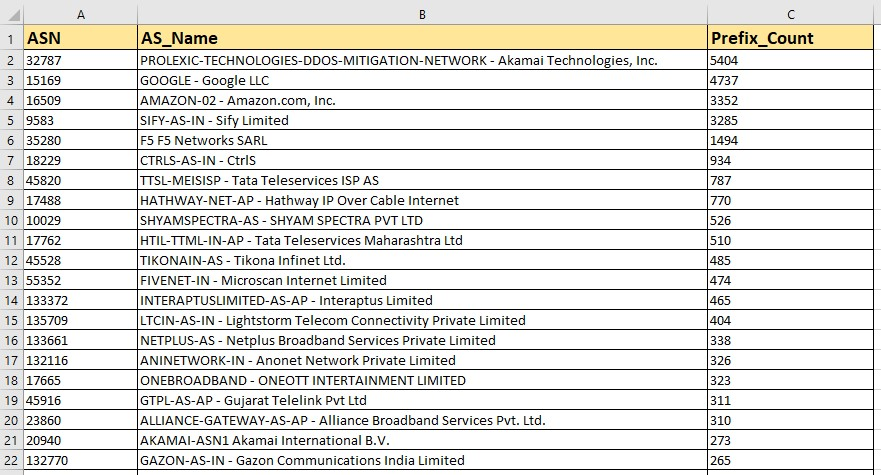

# Cisco BGP Received Routes ASN Analyzer


A lightweight Python utility that parses Cisco BGP received routes, counts the number of prefixes received from each Autonomous System (ASN), retrieves the ASN holder name from the RIPEstat API, and exports the results to a CSV file.

This tool is particularly useful for ISPs, network engineers, and peering coordinators who need to analyze upstream or peer routing information.

---

## Features

- Parses Cisco BGP received routes
- Counts unique origin ASNs
- Counts prefixes received from each ASN
- Retrieves ASN holder names using the RIPEstat API
- Exports results to CSV
- Caches API lookups to reduce duplicate requests
- Simple, lightweight, and easy to use

---

## Requirements

- Python 3.9+
- pandas
- requests

```bash
pip install pandas requests
```

## Supported Cisco Commands

### IPv4

```cisco
show ip bgp neighbors <NEIGHBOR-IP> received-routes
show ip bgp neighbors 203.76.110.1 routes | redirect bootflash:203.76.110.1-routes.txt
```

### VPNv4

```cisco
show ip bgp vpnv4 vrf <VRF_NAME> neighbors <NEIGHBOR-IP> received-routes
show ip bgp vpnv4 vrf <VRF_NAME> neighbors <NEIGHBOR-IP> received-routes | redirect bootflash:203.76.110.1-routes.txt
```

## Usage

1. Export or copy paste the BGP received routes from your Cisco router.
2. Save the txt file as `bgp_neighbor_routes.txt`.
3. Place the text file in the same directory as `asn_lookup_ripestat.py`.
4. Run:

```bash
python asn_lookup_ripestat.py
```

## Output

The script generates:

- `asn_prefix_count_with_names.csv`

Columns:

- ASN
- AS_Name
- Prefix_Count


# Screenshots

## 1. Verify Python Installation

Ensure Python is installed before running the script.



---

## 2. Running the Script

The script parses the exported Cisco BGP routes and performs RIPEstat lookups for each unique ASN.



---

## 3. Generated CSV Report

The final CSV contains the ASN, ASN holder name, and the number of received prefixes.




## RIPEstat Data API

https://stat.ripe.net/docs/data-api/ripestat-data-api

## License

MIT License
